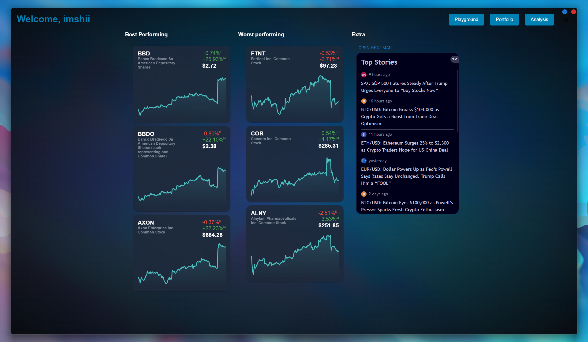
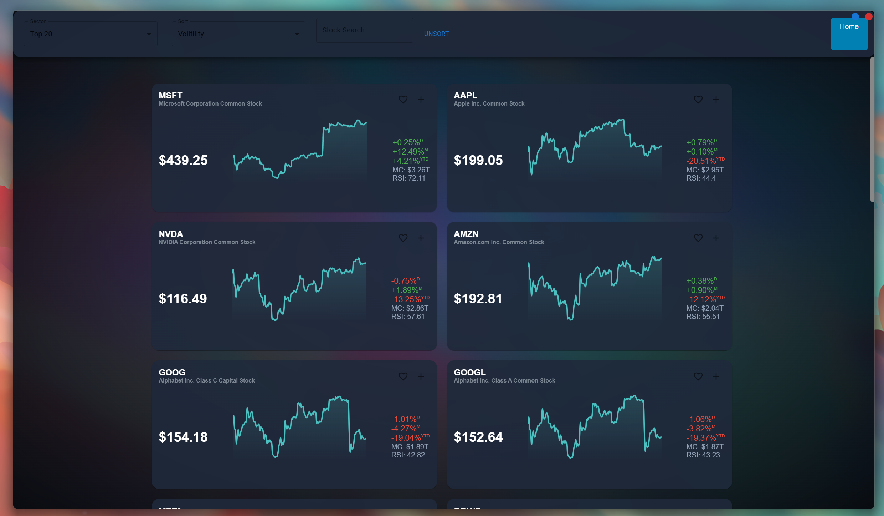

https://github.com/user-attachments/assets/1c5b1dc6-037e-4c1e-8bd2-42790a2decf0

# Investors Dream
This project is made to show the daily changes of us based stocks that are part of the s&p 500. 
I have wanted to visualize the changes to the stocks that are part of the Standard & Poor’s 500 
index fund but cannot find any tools online that can easily do so.
If you want to contribute, please change the api token used to your own, as to not spam mine. You can get a free api token [here](https://twelvedata.com/).

This is a tauri application, using nextjs as the front end
## Getting Started
Install all the required packages
```bash
npm install
```
To run the development application:
```bash
npm run tauri dev
```


### Build
If you want to build the project into a compact executable, you can easily do so.
```bash
npm run tauri build
```

Note: if you want the build to have the api keys inside (to eleminate the need for an env file bundled with the executable), you must add them to the sensitive_constants.rs file. To keep git from publishing these keys, you can untrack the file aswell using:
```bash
git update-index --assume-unchanged src-tauri/src/sensitive_constants.rs
```

## Homepage:


## Playground:


## Analysis:

